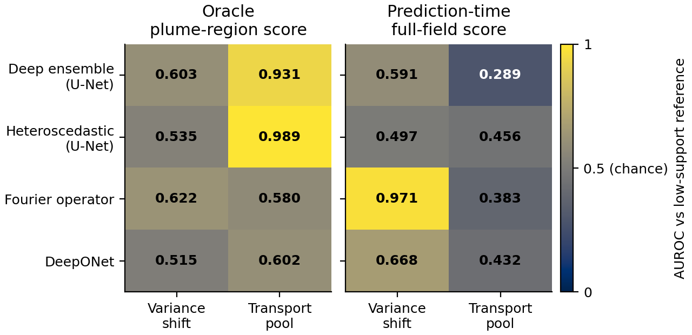

# Groundwater Surrogate Reliability

Code and scalar results for auditing neural groundwater-transport surrogates under conductivity-variance shifts and omitted transport controls.



This code-only snapshot contains model and evaluation implementations, fixed split definitions, sanitized parameter metadata, quantitative figure scripts, and corrected summaries. It does not contain simulation fields, simulator setup files, executables, checkpoints, prediction caches or private correspondence. Original project code and associated documentation use the MIT license; third-party terms are preserved in [THIRD_PARTY_NOTICES.md](THIRD_PARTY_NOTICES.md).

## Reproduce

From this folder, using the documented analysis environment:

```bash
python scripts/make_manifest.py --check
python scripts/verify_repository.py
python -m unittest discover -s tests -v
python scripts/build_v5_analysis.py --output-dir ../reproduced_v5
python scripts/verify_repository.py --reproduced-dir ../reproduced_v5
python scripts/build_selection_supplement.py --output ../selection_crc_baselines.json
python scripts/verify_repository.py --supplement ../selection_crc_baselines.json
```

Use a new output directory outside the package. These commands need no raw simulation data or GPU. The software tests additionally need PyTorch. See [REPRODUCE.md](REPRODUCE.md) for environment and restricted-data boundaries.

## Scope

- Four five-member monitors: deterministic U-Net, heteroscedastic U-Net, Fourier operator and DeepONet.
- Corrected physical-quality summaries contain all 42,800 case-time scalar records, not spatial prediction arrays.
- Four-family quality uses FP32; calibration exports and native review ranking retain their separate AMP protocol.
- Fixed-input dispersivity comparisons distinguish changes in a ground-truth scoring mask from changes in an uncertainty field.
- Calibration coverage is reported with its support, unit, mask and interval width. It is not a prospective safety guarantee.

Cases share a small number of geological draws. Results describe the finite benchmark design, not independent population samples. Unpaired-pool AUROC does not establish detection of omitted transport controls. A concentration sum is not a physical mass balance, and uncertainty ranking is not deployment authorization.

The editable workflow is [the draw.io source](figures/draw/fig1_workflow_drawio_v5.drawio). Quantitative panels use actual archived outputs or scalar records, not generated plume images. The associated manuscript discloses AI assistance with language, code review and workflow revisions; the authors retain responsibility for the results and interpretation.

## Availability

Repository: https://github.com/loc-k-nguyen/groundwater-surrogate-reliability. The manuscript-associated snapshot is identified by tag `ems-v5-2026-10-10-r1`. See [CODE_AVAILABILITY.md](CODE_AVAILABILITY.md), [RELEASE_SCOPE.md](RELEASE_SCOPE.md), [CHANGELOG.md](CHANGELOG.md) and [CITATION.cff](CITATION.cff). No archival DOI, journal submission or editorial status is asserted.
