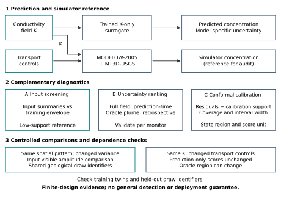

# Groundwater Surrogate Reliability

[](https://github.com/loc-k-nguyen/groundwater-surrogate-reliability/actions/workflows/ci.yml)

Research code for auditing neural predictions of groundwater contaminant transport under distribution shift. The analysis distinguishes input-distribution screening, model-specific uncertainty ranking, and conformal calibration. Four monitor families are included: a U-Net deep ensemble, a heteroscedastic U-Net, a Fourier neural operator, and DeepONet.



## Reproduce the analysis

Use Python 3.9.25 for the recorded analysis environment. No GPU or restricted data is needed for these commands:

```bash
python -m venv .venv
# Activate the environment using your operating system's venv command.
python -m pip install -r requirements-analysis-lock.txt
python scripts/build_v4_analysis.py --output-dir outputs/reproduction
python scripts/build_workflow_v4.py --output-dir outputs/reproduction
python scripts/verify_repository.py --reproduced-dir outputs/reproduction
```

Generators require a new or empty destination and refuse to replace existing results. Numerical reproduction is checked against the included source-traceable JSON, not PDF timestamps.

For model-source tests and CPU parameter counting, install PyTorch 2.1.0 using the appropriate CPU or GPU distribution for your environment, then run:

```bash
python -m unittest discover -s tests -v
python scripts/model_capacity.py --output outputs/reproduction/model_capacity_v4.json
python scripts/make_manifest.py --check
```

[REPRODUCE.md](REPRODUCE.md) documents the control analyses, training entry points, dependencies, and restricted-data stages. [The CI workflow](.github/workflows/ci.yml) specifies the CPU test environment.

## Scientific scope

The surrogates observe conductivity K, not the varied transport controls. A fixed-input dispersivity ladder therefore cannot change prediction-only uncertainty scores. Oracle plume-region scores may change because their scoring mask uses simulated concentration.

The geological generator shares draw identifiers across parameter settings. The main corpus contains at most five geological draws; the held-out-pattern control evaluates two. AUROCs, coverage, and paired differences are descriptive comparisons within this finite design. They do not establish population-level detection, distribution-free safety under shift, or deployability. Historical setting-bootstrap confidence intervals and permutation p-values are withdrawn from inference.

Review ranking handles exact score ties using expected uniform selection within each tie, with attainable order bounds. These bounds are not confidence intervals. The unpaired transport comparison also reflects differences between the input pools, so it is not a dispersivity-detection experiment.

## Repository layout

| Path | Contents |
|---|---|
| `src/` | Models, datasets, training, and evaluation source |
| `scripts/` | Descriptive analysis, figures, and verification tools |
| `tests/` | Focused regression tests |
| `results/` | Lightweight numerical inputs and correction records |
| `figures/v4_final/` | Reference outputs matching manuscript revision 4 |
| `splits/`, `metadata/` | Fixed split, normalization, and scientific design metadata |
| `docs/` | Provenance and metadata transformation record |

Internal model import paths are retained to avoid changing the validated implementation. Shared source is included; no other research repository is required for the documented summary reproduction.

## Availability and citation

This repository is being prepared privately for a future paper submission. No journal acceptance or archival DOI is claimed. Raw fields, simulator setups, executables, trained checkpoints, and prediction caches are not included. See [CODE_AVAILABILITY.md](CODE_AVAILABILITY.md).

Original project code is licensed under [MIT](LICENSE). This does not grant rights to restricted data or simulator assets, or replace third-party license obligations. See [RELEASE_SCOPE.md](RELEASE_SCOPE.md) and [provenance](docs/PROVENANCE.md).

Use [CITATION.cff](CITATION.cff) for software credit. Maintainer: [Loc K. Nguyen](https://github.com/loc-k-nguyen). The associated manuscript lists Loc K. Nguyen, Allanah Kenny, Theo S. Sarris, and Binh P. Nguyen; its publication metadata will be added once verified.
