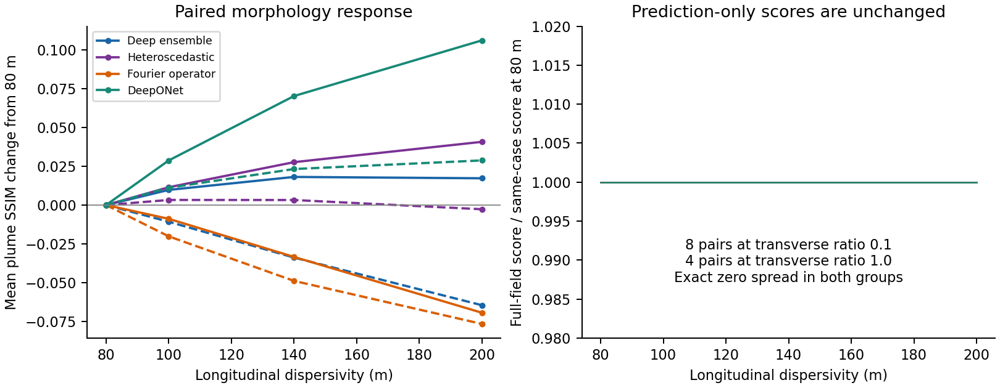

# Groundwater Surrogate Reliability

Code and scalar results for auditing neural groundwater-transport surrogates under conductivity-variance shifts and omitted transport controls.



This code-only snapshot contains model and evaluation implementations, fixed split definitions, sanitized parameter metadata, quantitative figure scripts, and corrected summaries. It does not contain simulation fields, simulator setup files, executables, checkpoints, prediction caches or private correspondence. Original project code and associated documentation use the MIT license; third-party terms are preserved in [THIRD_PARTY_NOTICES.md](THIRD_PARTY_NOTICES.md).

## Reproduce

From this folder, using the documented analysis environment:

```bash
python scripts/make_manifest.py --check
python scripts/verify_repository.py
python scripts/run_tests.py --suite fast
python scripts/run_tests.py --suite full --report ../cpu_tests.json
python scripts/synthetic_demo.py --output ../synthetic_fixture.json
python scripts/build_physical_diagnostics_v6.py --output-dir ../physical_diagnostics_v6
python scripts/build_v5_analysis.py --output-dir ../reproduced_v5
python scripts/verify_repository.py --reproduced-dir ../reproduced_v5
python scripts/build_selection_supplement.py --output ../selection_crc_baselines.json
python scripts/verify_repository.py --supplement ../selection_crc_baselines.json
```

Use new outputs outside the package. None of these commands needs raw simulation data or a GPU. Tests and the analytic synthetic demonstration need CPU PyTorch. The runner limits numerical-library threads to avoid oversubscription and reports actual elapsed time. The full suite retains all regression tests; the fast suite is an explicitly smaller entry point, not a replacement.

## Reproduction Levels

| Level | Publicly executable | What it establishes |
|---|---|---|
| Certified scalar analysis | Tables, paired/time profiles, calibration and tie-aware summaries | Reconstruction of supplied finite-design results |
| Synthetic numerical fixture | Joint row alignment, full 600 x 400 sliding windows, all 25 outputs and physical metrics | Numerical pipeline behavior on an analytic mapping, not trained-model accuracy |
| Restricted full experiment | Requires approved fields, frozen certificates and checkpoints | Not reproducible from this code-only download alone |

See [REPRODUCE.md](REPRODUCE.md) for producer/output mappings and [TRAINING_PROTOCOL.md](TRAINING_PROTOCOL.md) for historical training commands and external assets. Do not run training to reproduce scalar figures.

## Conformal API

`SplitConformalPredictor` requires `target_scale="physical"` or `target_scale="log10"`. A physical cutoff of `1e-8` becomes `-8` for unoffset log10 targets. For study targets `log10(C + 1e-12)`, also pass `log_offset=1e-12`. Ambiguous calls now fail rather than silently masking the wrong region. This generic API is not the producer of the manuscript's dedicated calibration rows; the correction does not revise those numerical results.

## Scope

- Four five-member monitors: deterministic U-Net, heteroscedastic U-Net, Fourier operator and DeepONet.
- Corrected physical-quality summaries contain all 42,800 case-time scalar records, not spatial prediction arrays.
- Four-family quality uses FP32; calibration exports and native review ranking retain their separate AMP protocol.
- Fixed-input dispersivity comparisons distinguish changes in a ground-truth scoring mask from changes in an uncertainty field.
- Calibration coverage is reported with its support, unit, mask and interval width. It is not a prospective safety guarantee.

Cases share a small number of geological draws. Results describe the finite benchmark design, not independent population samples. Unpaired-pool AUROC does not establish detection of omitted transport controls. A concentration sum is not a physical mass balance, and uncertainty ranking is not deployment authorization.

The editable workflow is [the draw.io source](figures/draw/fig1_workflow_drawio_v5.drawio). Quantitative panels use actual archived outputs or scalar records, not generated plume images. The associated manuscript discloses AI assistance with language, code review and workflow revisions; the authors retain responsibility for the results and interpretation.

## Availability

Repository: https://github.com/loc-k-nguyen/groundwater-surrogate-reliability. The v6 snapshot is identified by tag `ems-v6-2026-10-10`; the corrected v5 tag remains preserved. See [CODE_AVAILABILITY.md](CODE_AVAILABILITY.md), [RELEASE_SCOPE.md](RELEASE_SCOPE.md), [CHANGELOG.md](CHANGELOG.md) and [CITATION.cff](CITATION.cff). No archival DOI, journal submission or editorial status is asserted.
